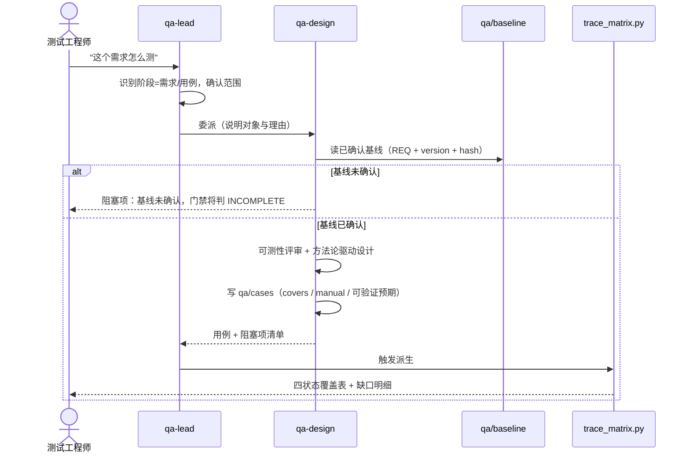
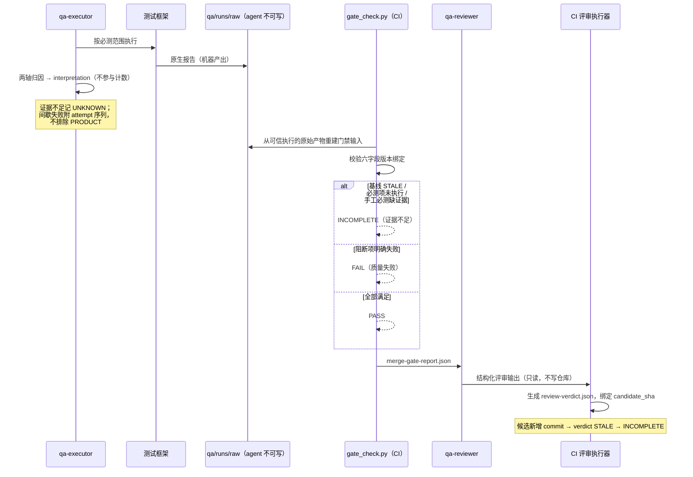

# QA Agent Suite — Design

**状态：** 已定稿
**平台事实来源：** `docs/capability-matrix.md`。本文件凡引用平台行为，均以该矩阵为准；
矩阵中标「未能验证」的能力**不作为设计前提**。

---

## 1. Overview

本体系用 Kiro 的四个原生构件组合出一条可追溯、可审计的测试流水线，把"判断"交给模型、
把"计算"交给脚本、把"强制"交给受保护 CI。

| 构件 | 承担 | 为什么放这里 |
|---|---|---|
| `.kiro/agents/*.json` | 角色、工具白名单、可委派关系 | 权限边界只能在配置层强制，prompt 里写"请不要"不是边界 |
| `steering/*.md` | 叙述性规范（红线、证据要求、失败分类） | 全体 agent 一致生效，改一处全体生效 |
| `skills/*` | 方法论、模板 | 按需加载，不污染上下文 |
| 受保护 CI | 门禁判定与证据重建 | 唯一拦得住的地方 |

三条贯穿设计的判断：

1. **确定性的事交给脚本。** 覆盖率、追溯校验、三态判定、门槛扫描全是 Python 脚本，
   输出可断言、可进 CI；模型只做设计、归因、评审这些需要判断的部分。
2. **评审 agent 无写权限。** 若评审者能改代码，独立性就是空话。配置层直接不给 write。
3. **不做默认的远端写入。** 缺陷系统、测试平台一律草稿 + 显式确认。误提单的清理成本
   远高于节省的时间。

### 1.1 已实测的平台约束（直接塑造了本设计）

| 实测结论 | 设计后果 |
|---|---|
| **shell 子进程写入完全绕过能力层**（含 kiro-scope 硬拒绝） | 可信计算基不能靠 `permissions` deny 保护；必须靠执行环境隔离 + 受保护 CI 重建证据 |
| **子代理自身权限在委派路径下未生效**（同一配置直接调用拒绝、委派调用写入，不涉及 shell） | 需先定位实际执行 `fs_write` 的进程边界，再设计覆盖该进程完整执行链路的隔离方案；若 `qa-lead`/`qa-executor` 共享同一进程，需拆分为独立执行单元——**不是**"隔离对此无效"，是隔离粒度需要重新划定；委派编排在权限证明完成前不得视为默认安全 |
| 子代理按 deny-wins 交集继承父规则（父层维度，与上一条不同轴） | `qa-lead` 的"不写"用 `tools` 省略表达，**不能**用 deny 规则 |
| headless / 子代理下 `ask` 等同 deny | 预期写路径必须显式 allow，否则"交互能跑、自动化静默失败" |
| **委派会触发一次性审批**（已验证的行为事实）；`trustedAgents`/`availableAgents` 在本 IDE 到底控制什么**尚未验证清楚** | `qa-lead` 不应设计成"免审批委派"；这两个字段的实际作用需补充探针，不能假设它们控制"能不能派"或"受不受权限约束" |
| **含 CLI-only 字段（`allowedTools`/`toolsSettings`）且无 `permissions` 块的配置会被 IDE 静默跳过**（已验证范围仅限此组合） | 正式 agent 配置若含 CLI-only 字段，需带 `permissions` 块；不含 CLI-only 字段的配置是否也需要，尚未测试，不外推 |
| `.kiro/steering/**` 无硬保护 | 门禁阈值与必测范围定义**不放 steering** |
| `.kiro/agents/**` 的"永久询问"退化为静默允许 | agent 配置不得视为受保护路径 |
| `execute_bash` 外层退出码恒为 -1；工具层报 `success:true` 时 `exitCode` 仍可能未采集 | 所有脚本判据必须在命令内捕获并打印 `$?`，不能信任任何外层退出码字段 |
| 模型对工具成功/失败、审批状态的自述与外部事实可能不一致（已发生 3 次） | 探针与脚本判据一律以外部可复核证据（哈希、拒绝原文、独立工具记录）为准，不采信模型自述 |
| 系统 python3 = 3.9.6（含 pytest），homebrew 3.14 无 pytest | 全部脚本按 **Python 3.9 兼容**编写，不引入依赖安装 |

---

## 2. Architecture

```mermaid
graph TB
    H[人工确认<br/>需求评审/PR审批角色] -->|维护+审批| B[(qa/baseline<br/>REQ + version + hash)]
    H -->|确认| P[(qa/plan<br/>required-scope.yaml)]

    U[测试工程师] --> L[qa-lead<br/>read subagent todo_list]
    L --> D[qa-design<br/>read write]
    L --> E[qa-executor<br/>read write shell]
    L --> R[qa-reviewer<br/>read only]

    B --> D
    D -->|covers 标注| C[(qa/cases)]
    C --> E
    E -->|@case 标记| T[(测试代码)]
    E -->|归因/草稿| I[(qa/runs/**/interpretation)]
    E -->|缺陷草稿| F[(qa/defects)]

    FW[测试框架] -->|原生报告<br/>agent 不可写| N[(qa/runs/**/raw)]
    T --> FW

    B & P & C & T & N & I & F --> S1[trace_matrix.py]
    S1 --> M[(matrix.csv<br/>派生·无写入者)]
    M --> S2[gate_check.py]
    T --> S3[guard_scan.py]
    S3 -->|提示段落| S2
    S2 --> RP[(merge-gate-report.json<br/>PASS/FAIL/INCOMPLETE)]
    RP --> R
    R -->|结构化输出| CX[CI 评审执行器]
    CX --> V[(review-verdict.json)]
    V --> S2
    S2 -.->|required check| CI[受保护 CI = 唯一门禁]
    RP -.->|输入之一| REL[发布准出决策<br/>另一层]
```

### 2.1 四角色与权限

| 角色 | 职责 | tools | 写入范围 | 备注 |
|---|---|---|---|---|
| `qa-lead` | 入口、范围确认、调度、汇总 | `read`, `subagent`, `todo_list` | 无 | **tools 省略表达不写，禁用 deny 规则** |
| `qa-design` | 需求可测性、用例设计、`covers` 标注 | `read`, `write` | `qa/cases/**` | 只读基线 |
| `qa-executor` | 对接现有框架、执行、归因、缺陷草稿 | `read`, `write`, `shell` | `qa/runs/**/interpretation.*`、`qa/defects/**`、测试代码目录 | 写路径显式 allow；须执行环境隔离 |
| `qa-reviewer` | 只读独立评审、核对门禁证据 | `read` | 无 | 输入限定 diff + 关键调用方 + 门禁报告 |

`qa-lead` 用 `toolsSettings.subagent.availableAgents` 限定可派对象。
`tools` 标签的最终取值以 `docs/capability-matrix.md` item 12 实测结果为准（已验证，见 item 12 结论）。

**⚠ 委派链路的应用层权限判定尚未证明可靠（item 8，2026-09-20 新增、2026-09-20 修正）。**
实测发现：同一份子代理配置直接调用时其 `permissions.deny` 生效，被 `qa-lead` 这类
父代理委派调用时**同一条 deny 未生效**（对受保护路径的写入成功），且不涉及 shell。
这意味着"给 `qa-executor` 配置 `permissions` 就能限制它的写入范围"这一假设，在委派
路径上尚未证明成立。

**这不等于"执行环境隔离对此无效"。** 操作系统级隔离约束的是发起写入的进程，不关心
该进程内部哪个逻辑角色在调用；item 8 暴露的真正问题是 `qa-lead` 与被委派的
`qa-executor` 逻辑目前运行在**同一个宿主进程**内，进程级隔离无法只约束其中一个角色。

**进程观测结果（2026-09-21，表述已按外部复核收窄）**
（证据与适用范围见 `docs/probe-evidence/task3/task3-findings.md`）：

- agent 的 shell 命令是 `Kiro Helper`(pid 3612) → `Kiro`(3590) 的后代进程，无额外隔离
- 委派子代理执行 `fs_write` 期间，**本轮 248 次快照（实测相邻间隔 max 0.105s）没有记录到**
  Kiro 树中的新建进程（唯一出现的 `sh` 与探针自身执行 shell 命令同时刻，归因于测量自身）
- 检测下限（每寿命重复 5 次）：1s / 300ms / 150ms / 100ms 均 5/5，**50ms 为 3/5、20ms 为 1/5**
- **以上不是 PID 归属。** 采样器只观察进程创建；写入完全可能由采样开始前就存在的常驻进程
  完成。因此**不得**推出"不存在 per-agent 进程边界""委派链内部拆分不可能""顶层会话即独立
  进程"——这些推论**已撤回**（原版本写过，属超出证据）

在此基础上，Task 3 的状态是**部分完成**：

- **`qa-lead → qa-executor` 的委派 SHALL NOT 被视为默认安全边界。** 依据是 item 8 的
  行为观测（同一配置直接调用 deny 生效、委派调用 deny 失效），**与进程架构无关**。
- **安全关键的角色分离用结构性手段实现：** 需要其写入范围被强制的角色，SHALL 以
  **顶层会话直接调用**（该路径下 deny 已验证生效），SHALL NOT 依赖父代理委派。
  这只是基于已观测权限行为的临时措施，不声称顶层会话具备进程级隔离。
- 写入操作的**权威 PID 归属仍未取得**，需内核级追踪（覆盖直接与委派两条链路、唯一
  canary、记录实际 open/write/rename 事件）；单次归属结果不得扩大为永久架构保证。
- **`toolsSettings.subagent.availableAgents/trustedAgents` 在本 IDE 到底控制什么，
  仍未验证清楚。** 已确认的行为事实只有一条：委派会触发一次性审批。不能反推这两个
  字段"控制能不能派"或"不控制受不受权限约束"——这类细分的双重结论超出了现有证据，
  需要补充探针才能下定论（见能力矩阵 item 12 结论一节的类似修正）。
- `qa-lead` 委派 `qa-executor` 时出现审批提示是**正常行为**，不应设计为要绕过它。

**评审独立性边界：** 子代理只提供上下文隔离，同模型同盲点，不等于独立判断。
权限/安全边界、持久化数据变更、并发控制、跨模块协议变更仍需人工独立评审；
agent 评审是前置过滤网，不是替代品。这条边界现在还要加一层：`qa-reviewer` 若也通过
委派方式被调用（例如 CI 评审执行器派它），需要单独验证委派路径下"只读"是否真的
被强制——不能假设 item 7 验证过的"父子权限交集"结论覆盖了 item 8 揭示的委派路径问题，
两者是不同的轴。

### 2.2 产物所有权（每份产物唯一写入者）

| 产物 | 写入者 | 备注 |
|---|---|---|
| `qa/baseline/**` | 人 | 覆盖率分母，需审批引用 |
| `qa/plan/**/required-scope.yaml` | 人 | 必测范围，不得由结果反推 |
| `qa/cases/**` | `qa-design` | |
| 测试代码（`@case` 标记） | `qa-executor` | |
| `qa/runs/**/raw/*` 框架原生报告 | 框架 / CI | **agent 不可写** |
| `qa/runs/**/interpretation.*` | `qa-executor` | **不参与通过计数** |
| `matrix.csv`、`merge-gate-report.json` | 脚本（CI） | **无 agent 写入者** |
| `review-verdict.json` | CI 评审执行器 | 产物在候选控制之外 |
| 人工审批记录 | 平台 API | 不落仓库 |

### 2.3 可信计算基

候选变更不可单方面改动：`qa/baseline/**`、`qa/plan/**/required-scope.yaml`、门禁脚本与规则文件、
重试策略配置、`review_mode`、CI 配置、CODEOWNERS 本身。

**强制点是受保护分支 + CODEOWNERS 审批。** 哈希校验只是检测辅助——已实测确认 shell 子进程可
绕过能力层改写任意文件，所以任何"靠权限规则保护产物"的说法都不成立。

---

## 3. Sequence Diagrams

### 3.1 需求 → 用例 → 追溯



### 3.2 执行 → 归因 → 门禁 → 评审



---

## 4. Component / Data / Workflow Design

### 4.1 追溯数据模型

```
REQ (qa/baseline/<feature>/requirements.yaml，人确认)
 └─ TC (qa/cases/<feature>/*.md frontmatter: id, covers:[REQ], manual)
     └─ AT (测试代码 @case("TC-x")，由 collect 实际发现)
         └─ attempt (raw 报告: test id + param + 序号)
```

四状态判定：

| 状态 | 来源 | 反例（不得判错） |
|---|---|---|
| 已设计 | 基线 REQ 至少关联 1 条 TC | — |
| 已自动化 | TC 被**实际 collect 到**的 AT 引用 | `manual: true` 的 TC 不进此分母 |
| 已执行 | TC 的全部关联 AT 均有 attempt | — |
| 已通过 | 全部关联 AT 的全部 param 通过 + 运行满足必测范围与版本绑定 | 通过用例无缺陷不算错 |

多对多规则：TC 通过 = 其所有关联 AT 均通过；参数化：所有 param 通过才算该 TC 通过。

### 4.1.1 结果三态聚合（`last_result`）

**缺失与跳过不是失败。** 把"没测"算成"测出问题"会让门禁给出错误的分类，
本该是 `INCOMPLETE` 的候选被判成 `FAIL`，掩盖真正的证据缺口。

| 观察 | 聚合结果 |
|---|---|
| 任一 AT 末次 `failed` / `error` | `False`（确有失败） |
| 否则任一 AT 无 attempt、或末次 `skipped`/`xfailed`/未知 | `None`（结果不完整，属证据问题） |
| 全部 AT 末次 `passed` | `True` |

逐 AT 原始状态保留在 `per_case[tid]["at_statuses"]` 里供审计，不做有损压缩。

### 4.1.2 唯一有效执行范围

`required_requirements` 不能只校验"REQ 是否存在"——那样按 REQ 指定的范围根本不参与结果判定。

```
有效执行范围 = required_cases ∪ expand(required_requirements → 覆盖它的 TC)
```

门禁只认这一份（`TraceReport.effective_required_cases`）。配套规则：

- 必测 REQ 没有任何用例覆盖 → `REQUIRED_REQ_WITHOUT_CASE`，不得放行。
- 展开出的 TC 不在 `required_cases` 中 → `SCOPE_EXPANDED_FROM_REQ` 提示，
  报告同时列出"声明 N 条 / 有效 M 条"，让两份清单的差异可见。
- 手工用例走**同一条**范围判定路径：不进可自动化分母，但必须有执行证据。

### 4.1.3 缺陷阻断判定契约

三个字段各管一件事，缺一不可：

| 字段 | 作用 |
|---|---|
| `closed` | 已关闭 → 不再阻断，但仍记录在案 |
| `confirmed_blocking` | 人已确认它阻断 → 阻断 |
| `severity` | 落在 `required-scope.blocking_defect_severities` 内 → 阻断 |

未关闭 且（`confirmed_blocking` 或 `severity` 命中清单）= 阻断。
这样 `blocking_defect_severities` 是真的参与计算，不是占位配置。

**REQ 级关联必须传播。** 只关联 `req` 而未关联 `tc` 的缺陷，会传播到本次覆盖该 REQ 的
所有用例（`per_case[tid]["defects_via_req"]` 可查来源）。否则"这条需求坏了但还没定位到
具体用例"的缺陷会被静默丢弃。既未关联 TC 也未关联 REQ → `DEFECT_UNLINKED` 缺口。

校验分类：

| 情形 | 判定 |
|---|---|
| 引用不存在的 TC ID | 错标 → 校验失败 |
| 非 manual 的 TC 无 AT | 漏标 → 报缺口 |
| AT 无 TC 标记 | 未归属 → 提示 |
| 基线内容哈希变更 | 关联证据标 STALE |
| 基线为空 | **不判通过** |

`manual: true` 不进可自动化分母，**但仍进必测范围校验**；v1 若不支持人工执行证据采集，
含手工必测项的候选一律 `INCOMPLETE`。

### 4.2 两轴归因

| 根因 | 判定依据 | 必备证据 |
|---|---|---|
| `UNKNOWN` | 证据不足 | 已收集证据清单 + 缺什么 |
| `ENV` | 服务不可用、版本不符、依赖未就绪 | 健康检查输出、版本对比 |
| `DATA` | 前置数据缺失或被污染 | 数据查询结果 |
| `SCRIPT` | 断言写错、选择器失效、时序假设 | 代码定位 + diff |
| `PRODUCT` | 实际行为与需求不符 | 请求/响应、日志、trace、最小复现 |
| `DEPENDENCY` | 上游或三方故障 | 上游响应/状态 |

稳定性轴独立取值：`稳定失败 / 间歇失败 / 未确认`。
`FLAKY` 不是根因取值——把观察当根因是范畴错误，也正是并发缺陷被重跑掉的通道。

### 4.3 三态门禁与版本绑定

判定顺序（短路）：

```
1. 任一阻断项明确失败                → FAIL
2. 无明确失败 但 必需证据不完整        → INCOMPLETE
3. 全部必需检查满足                  → PASS
```

证据不完整的触发条件：必测项未执行、结果缺失、执行中断、证据版本不匹配、
基线 STALE 或未确认、手工必测项缺证据、reviewer 阻断未关闭。

版本绑定六字段：

| 字段 | 取值来源 |
|---|---|
| `candidate_sha` | 候选 HEAD |
| `target_sha` | 合并目标分支 HEAD |
| `policy_version` | **`target_sha` 上已批准版本**（门禁规则、重试策略、`review_mode`） |
| `baseline_version` | **针对本次变更已确认的版本**（需求基线、本次必测范围） |
| `baseline_hash` | 基线内容哈希 |
| `baseline_approval_ref` | 审批引用 |

**"字段齐全"不等于"绑定成立"。** 两条必须同时满足，否则一律 `INCOMPLETE`：

1. **缺字段不得跳过核对。** 写成"字段非空且不相等才报错"会让删掉字段反而通过 ——
   这是反向激励。必填字段先查存在性：运行记录必须绑定 `candidate_sha`、
   `baseline_version`、`baseline_hash`；`automated_required` 下评审结论必须绑定
   `candidate_sha` 与 `review_config_version`。
2. **必须与实际使用的证据交叉核对。** 调用方给的 binding 可能与磁盘上的基线无关，
   因此要比对 `binding.baseline_hash` / `baseline_version` 与追溯层算出的实际基线；
   用例文件与必测范围声明的 `baseline_version` 也要与基线一致；运行记录若声明了
   `target_sha` / `policy_version`，同样必须与本次评估一致。

merge-base 仅用于计算差异范围，不作规则来源。规则变更在合并进目标分支后对**后续**候选生效，
不对提出该变更的候选自身生效——这样新规则能启用，候选也无法用自带新规则给自己放行。

**基线流程采用方案 B（v1 默认）：** 基线先独立审批合入目标分支，再提实现变更。
分母永远在受保护分支上，`target_sha` 统一适用，无需为候选自带基线额外搭审批证据校验。
后备方案 A（候选携带已确认基线）需同时满足：基线路径纳入 CODEOWNERS、门禁校验该路径变更
存在**平台审批记录**（非仓库内文件声明）、`baseline_approval_ref` 指向该记录。

结果双字段：`last_result`（观察）与 `gate_accepted`（判定）分开存储。
已确认的阻断产品缺陷不被一次重试通过覆盖；未解释的间歇失败不自动满足门禁。

### 4.4 评审链路与模式

| 环节 | 归属 | 约束 |
|---|---|---|
| 结构化评审输出 | `qa-reviewer`（只读） | 输出到会话/artifact，不写仓库 |
| `review-verdict.json` | CI 评审执行器 | 绑定 `candidate_sha` + 评审配置版本 + 证据标识 |
| 必需人工审批 | 平台审批记录（API） | 不读仓库内文件 |
| 阻断关闭 | 具备审批权限的人 | 需说明依据；候选新增 commit → verdict 与人工审批一并 STALE |

**可信处置数据与未验证文件必须分开。** 磁盘上存在一份 JSON 不等于它可信。
`check_review()` 返回 `trusted_verdict`，只在来源（`produced_by`）与版本
（`candidate_sha`、`review_config_version`）都已验证时才非 `None`；它是后续消费处置
记录的**唯一**合法输入。

- `manual` 模式**不消费**仓库内的 `review-verdict.json`：人工模式的处置依据是平台审批
  记录，本地无法验证其来源与权限。否则候选只要往仓库里塞一份 JSON 就能关掉质量门槛提示。
  发现该文件时输出 `REVIEW_VERDICT_IGNORED_IN_MANUAL_MODE` 提示，说明它被忽略。
- 关闭一条门槛提示只有两条合法路径：受保护路径下的豁免（同时给出 `reason` 与
  `alternative_coverage`），或**已验证**的评审处置（逐项给出 `hint_id` +
  `reason` + `alternative_coverage`）。
- 处置必须按 `hint_id` **逐项**进行。`hint_id` 取 `(code, file, evidence)` 的摘要，
  因此同一规则码在不同文件里是不同的标识 —— 按规则码"确认"会一次关掉多个文件里的
  不同提示，这条路被 `GUARD_ACK_MALFORMED` 堵掉。

`review_mode` 预先固定，属受保护门禁配置：

| 模式 | 判定 |
|---|---|
| `manual` | 项目事先确定；满足规定的平台人工审批即可；报告注明未运行自动评审 |
| `automated_required` | agent 超时 / 权限拒绝 / 输出无法解析 / verdict 缺失 → 一律 `INCOMPLETE`，不得临时切 `manual` 后通过 |

CI reviewer 按评审职责配置为只读，并显式授权所需读取与调用能力，避免依赖交互审批
（**不得把只读归因于 headless 运行模式**——headless 的限制是无法交互批准，已显式允许的写仍会执行）。

### 4.5 三层执行

| 层 | 作用 | 是否门禁 |
|---|---|---|
| Kiro hook | 即时反馈（仅对 agent 改动；File 类仅 IDE） | 否 |
| git hook | 本地自检 | **否**（可被 `--no-verify` 绕过） |
| 受保护分支 CI required check | 合并门禁 | **是，唯一** |

本地 `make gate` 仅供自检；合并只认 CI 从可信执行的原始产物重新生成的那份。
扫 diff 里的 `--no-verify` 发现不了终端里真正用了这个参数——那是把终端行为当文件内容查。

### 4.6 执行隔离（`isolation/`，2026-09-21 落地并两轮验证）

针对 item 5（shell 子进程写入绕过能力层）。shell 命令跑在我们能控制的子进程里，
所以这条路径**可以**用容器边界约束；而工具级 `fs_write` 在 IDE 宿主进程内执行，
不经过这里（item 8，需单独闭环，**不能由本方案代替**）。

| 构件 | 作用 |
|---|---|
| `isolation/mount-policy.yaml` | **可写范围由策略决定，不由调用参数决定**：`allowed_rw` 白名单 + `protected` 双重否决 + 镜像引用/digest + `network.mode` |
| `isolation/mount_policy.py` | 策略校验器（可单测）：路径归一化、仓库外穿越、符号链接组件、仓库根重叠、rw 间嵌套、受保护路径、镜像覆盖 |
| `isolation/run-isolated.sh` | 执行包装器：自己**不拼**任何挂载参数，全部交策略生成；拒绝 `QA_ISOLATION_REPO` 覆盖仓库根 |
| `isolation/probes/net_probe.py` | 网络探针：只报事实（接口列表 / errno / 三态 verdict），不下判定 |
| `isolation/verify-isolation.sh` | 边界验证 C0–C9，每条要求"命令确实执行 + 拒绝原文 + 宿主机 canary 前后哈希" |

**验证结果（`docs/probe-evidence/task3/results/isolation-verify-c0-c9.txt`）：C0–C9 全 PASS。**

| 检查 | 内容 |
|---|---|
| C0 | 镜像身份：本机 digest 必须等于策略记录值，否则后续结论作废 |
| C1 | 阳性对照：白名单内可写挂载写入成功、宿主机可见 |
| C2 | 只读挂载内写入：`Read-only file system` + canary 哈希未变 |
| C3 | 未挂载的宿主机路径：容器内**不存在**（靠不存在，不靠权限判定） |
| C4 | 网络：仅 `lo` 接口 + errno 限定 `ENETUNREACH/EHOSTUNREACH` + **同端点**可达性阳性对照 |
| C5 | 仓库根整体只读：连 `VERSION` 也写不动 |
| **C6** | **回归 R1**：`--rw qa/baseline` 重新挂载受保护目录 → 退出 65 + `PROTECTED_PATH`，容器未启动 |
| **C7** | **回归 R2**：`--rw ../outside` 父目录穿越 → 退出 65 + `OUTSIDE_REPO`，容器未启动 |
| C8 | `QA_ISOLATION_IMAGE` 覆盖镜像 → 拒绝 |
| C9 | `QA_ISOLATION_REPO` 覆盖仓库根 → 退出 78（否则受保护清单整体失效） |

另：容器内跑完仓库全量测试 **292 项通过**；`isolation/` 自身有 58 项单测
（`tests/test_mount_policy.py` 42 + `tests/test_net_probe.py` 16）。

**依赖与可重复性（按实际锁定程度表述）：** 执行期 `--network=none`，依赖只能构建期装。
已锁：基础镜像按 **manifest digest** 固定、pip/pytest/PyYAML 及其传递依赖
（pluggy/iniconfig/packaging/pygments）固定版本、构建时跑 `pip check`。
未锁：**没有** `--require-hashes`，只锁版本号不校验包内容；基础镜像内系统包未单独审计；
digest 是 arm64 平台的，换平台需重取并重跑验证。

**未闭环的强制点（不要当成已解决）：**

1. 上述只证明"**如果**命令通过包装器执行，边界成立"。当前**没有机制强制** `qa-executor`
   必须走包装器，它同样可以直接在宿主机跑命令。候选路径是把该角色 shell allow 收窄到
   只有 `isolation/run-isolated.sh`（命令层规则生效已由 item 6 验证），但 item 6 同时发现
   `bash -c` 与变量间接会进入 `ask` —— 需实测确认子代理/headless 下确实等同 deny。
2. **策略文件与校验器本身在仓库里**，对宿主机有写权限的 agent 可以改掉它们。这是护栏，
   不是安全边界；强制点仍是受保护分支 + CODEOWNERS + CI 复核。`verify-isolation.sh` 会
   打印策略与脚本的 sha256 manifest，供 CI 核对"跑的是不是这套规则"。

**踩过的坑（都会伪装成"隔离生效"或"边界成立"，写在这里避免重犯）：**

1. **包装器接受调用方任意 `--rw`（外部复核实测出两条真实绕过）。** `--rw qa/baseline`
   把受保护的覆盖率分母重新挂成可写、`--rw ../outside` 穿越到仓库外，两条都写入成功、
   退出 0、宿主哈希变化。原因是当时只检查"目录存在"。现已改为策略白名单 + 受保护双重
   否决，并把这两条固化为 C6/C7 与单测回归场景。
2. **C4 捕获所有 `OSError` 就报"网络已隔离"。** 复核的离线故障注入证明
   `ConnectionRefusedError`、`TimeoutError` 同样命中 PASS。现改为结构性证据 + errno 限定
   + 同端点阳性对照；本机实测 `1.1.1.1:443` 本就被链路挡住，若拿它当阳性对照会得出
   假结论，所以端点改为在默认网络下逐个探测后选定。
3. **默认镜像与构建好的镜像没接上。** 默认是 `python:3.12-slim`，只有显式设环境变量才用
   `qa-executor`，结果默认镜像里 `import pytest` 直接 `ModuleNotFoundError`。现在默认取
   策略镜像，且默认拒绝覆盖。
4. `run-isolated.sh` 最初没有可执行位，5 条命令全是 `permission denied`，而 C2 当时只看
   "canary 哈希未变"就报 PASS。**凡"没发生坏事"型判据，必须附带"坏事确实被尝试过"的
   证据**，否则一律作废。
5. zsh 会把 `"$WORKDIR:ro"` 解析成历史修饰符 `${WORKDIR:r}` 再接字面 `o`，挂载点静默
   变成 `/worko`：容器照样启动，但**什么都没挂上**。挂载串里的变量必须加花括号。

---

## 5. Constraints / Tradeoffs

| 约束 | 取舍 |
|---|---|
| 子进程可绕过能力层 | 只能靠执行环境隔离；接受"加隔离前不宣称可信"，而非用权限规则假装安全 |
| 同模型评审有共同盲点 | 子代理评审作过滤网，关键变更仍需人工；接受多一道人工成本 |
| 溯源分离防不住弱化断言 | 保留 `guard_scan` + 人工评审；接受误报，不承诺完整召回 |
| v1 不发阈值数字 | 只发完整性规则；接受"暂时不能量化质量水位"，避免编造无依据阈值 |
| 方案 B 需两个 PR | 换取分母永在受保护分支；接受流程略慢 |
| Python 3.9 兼容 | 不用 `X \| None` 等新语法；换取零依赖安装 |
| `matrix.csv` 为派生产物 | 每次需重算；换取无写入者、无漂移、无法手工编造 |

### 残余风险（必须保留在文档中）

溯源分离能防伪造结果，**防不住弱化断言**——不断言的测试在原生报告里同样是 passed，
而测试代码可能由 agent 编写。因此：

- `guard_scan` 定位为**风险提示器**，能识别显式 skip/xfail、断言删除、阈值数字变化、
  忽略范围扩大、重试次数/策略变化、测试文件删除；
- **不能**判断断言语义是否被削弱、数据清理是否有效；
- 对测试代码变更的人工评审**不因**溯源分离而取消。

---

## 6. Testing Strategy

分三类，不混用判据：

| 类型 | 对象 | 方法 | 不做什么 |
|---|---|---|---|
| 确定性单测 | `trace_matrix.py`、`gate_check.py`、`guard_scan.py`、`validate_*.py` | pytest 真实断言，含正反例 | — |
| 结构检查 | spec 三件套、agent 配置、skill frontmatter | schema / 关键字 / 状态标记 | **不**把格式合规表述为内容正确 |
| 场景评测 | agent 输出（可测性评审、用例设计、归因） | fixture + rubric，记录模型与配置版本、漏报/误报、人工抽检 | **不**写只断言"文案里出现某词"的假测试 |

探针类验证另按 `docs/capability-matrix.md` 的分类判据执行（拒绝类需三段证据 + 阳性对照）。

### 六条反例作为必过用例

1. 没有真正执行的越权探针不得算通过
2. 先失败后通过不得自动抹掉阻断
3. 手工必测项缺证据不得放行
4. 旧 SHA 的评审结论不得用于新候选版本
5. 候选自提 `approved: true` 不构成评审通过
6. `automated_required` 下评审失败不得临时切 `manual` 后通过

### 验证命令

```bash
make check     # validate_spec + validate_agents + 全部 pytest
make gate      # 本地自检（非门禁）
```
